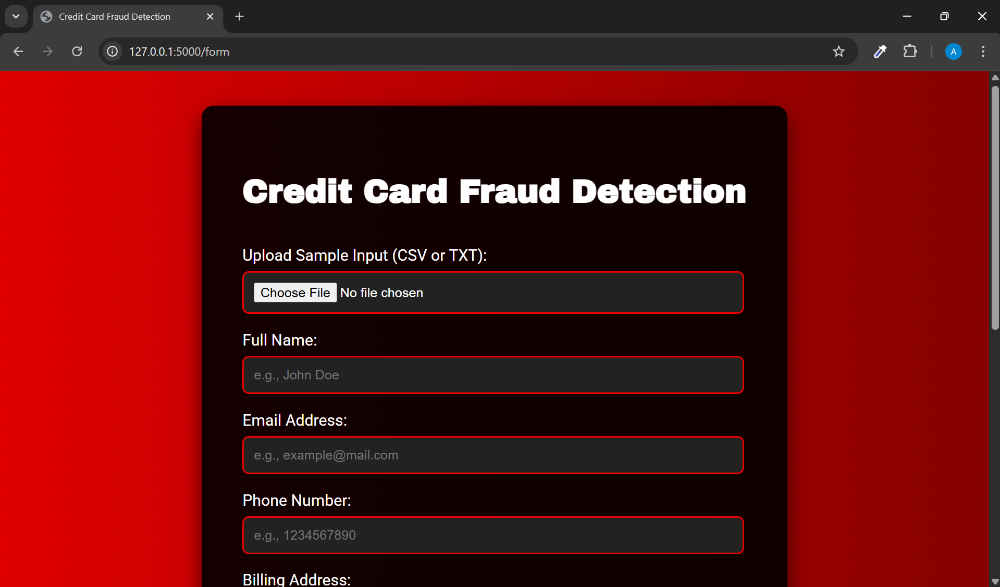
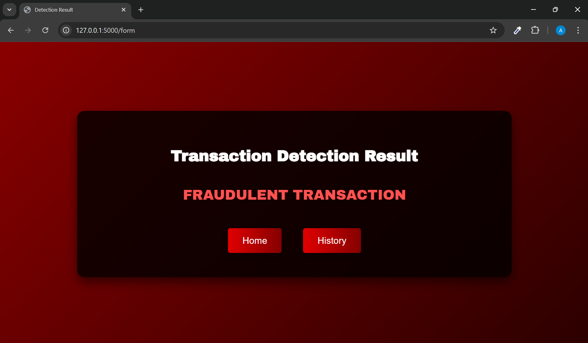

# Credit Card Fraud Detection

This project uses machine learning to detect fraudulent credit card transactions. It includes a web-based interface for data input, prediction display, and history tracking using Flask.

## Project Structure

```
credit-card-fraud-detection/
│
├── .ipynb_checkpoints/             # Auto-saved notebook checkpoints
│
├── project_images/                 # Screenshots for UI and results
│   ├── form.png
│   ├── history.png
│   ├── home.png
│   ├── result_fraud.png
│   └── result_valid.png
│
├── templates/                      # HTML templates for Flask routes
│   ├── form.html
│   ├── history.html
│   ├── index.html
│   └── result.html
│
├── uploads/                        # Uploaded/test CSVs
│   ├── fraud_data.csv
│   ├── frauds_data.csv
│   └── valid_data.csv
│
├── app.py                          # Main Flask backend app
├── fraud_detection.pkl             # Serialized trained model
├── Fraud_Detection.ipynb           # Notebook for data analysis and training
├── creditcard.csv.zip              # Original dataset (zipped)
├── .gitignore                      # Git ignore rules
└── README.md                       # Project documentation

````

## Features

* Upload CSV files and detect fraudulent transactions
* Displays prediction results (fraud/valid) visually
* Stores and displays history of uploaded results
* Trained model serialized with `pickle`
* Frontend built using HTML templates rendered by Flask

## Installation & Setup

1. **Clone the repository**
```bash
git clone https://github.com/your-username/credit-card-fraud-detection.git
cd credit-card-fraud-detection
````

2. **Create a virtual environment (optional but recommended)**

```bash
python -m venv venv
source venv/bin/activate  # On Windows: venv\Scripts\activate
```

3. **Install dependencies**

This project uses the following Python packages:

```bash
pip install flask pandas numpy scikit-learn matplotlib seaborn
````

4. **Run the app**

```bash
flask run
```

5. **View in browser**

Navigate to `http://127.0.0.1:5000/` in your browser.

## Dataset

* The dataset used is from [Kaggle's Credit Card Fraud Detection](https://www.kaggle.com/mlg-ulb/creditcardfraud)
* Features are numerical values transformed by PCA for confidentiality
* Highly imbalanced dataset (fraud cases are very rare)

---

## Model Information

This project uses a machine learning model trained to classify credit card transactions as **fraudulent** or **legitimate** based on a set of anonymized features derived from the original dataset.

### Model Type

* **Random Forest Classifier**:
  A powerful ensemble learning method based on decision trees. It works by building multiple trees on various data subsets and averaging their predictions to improve accuracy and reduce overfitting.

> Initially, logistic regression was considered due to its interpretability, but Random Forest was ultimately selected for its better performance in handling imbalanced and high-dimensional data.

---

### Input Features

* A total of **30 features** were used, including:

  * `V1` to `V28`: Principal components obtained via PCA for confidentiality
  * `Time`: Seconds elapsed between the transaction and the first transaction
  * `Amount`: Transaction amount

---

### Target Variable

* **Class**: Binary output

  * `0` – Valid transaction
  * `1` – Fraudulent transaction

---

### Handling Class Imbalance

The dataset is **highly imbalanced**, with fraudulent transactions making up only \~0.17% of the total data. To address this, the following technique was applied:

* **SMOTE (Synthetic Minority Oversampling Technique)**:
  Oversamples the minority class by generating synthetic samples, improving model generalization on rare fraud cases.

---

### Evaluation Metrics

The trained model is evaluated using the following metrics:

* **Accuracy**: Measures overall correctness
* **Precision**: Measures how many predicted fraud cases were actually fraud
* **Recall (Sensitivity)**: Measures how many actual fraud cases were correctly identified
* **F1-Score**: Harmonic mean of precision and recall
* **Matthews Correlation Coefficient (MCC)**: Balanced metric even for imbalanced datasets

---

### Model Serialization

* The final trained model is saved as `fraud_detection.pkl` using Python’s `pickle` module.
* This file is later loaded in the Flask application (`app.py`) to make real-time predictions on new transaction data uploaded by the user.

---

## File Descriptions

* `app.py` – Flask backend logic
* `Fraud_Detection.ipynb` – Data preprocessing, model training
* `fraud_detection.pkl` – Trained model
* `templates/*.html` – HTML files rendered by Flask
* `uploads/*.csv` – Uploaded or sample test files

---

## UI Preview

* **Homepage**
  

* **Upload Form**
  

* **Valid Transaction Result**
  

* **Fraudulent Transaction Result**
  

* **Upload History**
  

